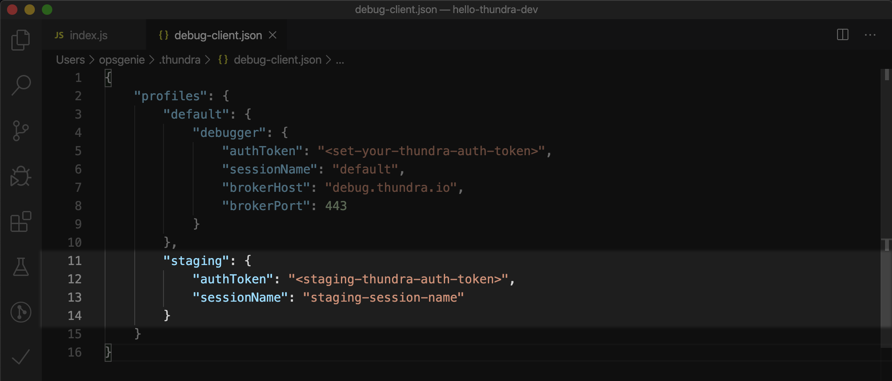
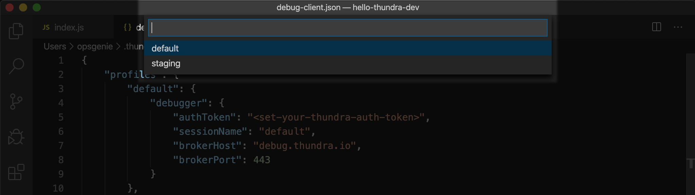

# Thundra Debugger
<em>Issue repository for Thundra Debugger VSCode Extension</em>

Start online debug sessions while the AWS Lambda functions run on AWS Cloud. Thundra sets up an easy and secure connection between your AWS Lambda functions and VSCode. Debug your serverless applications natively with their own permissions. Stop mocking resources and simulating the environments! Put breakpoints and pause the execution of the Node.js and Python functions to see the stack trace.

## Installation
* Install the extension from the market place.
* [Sign up](https://console.thundra.io/signup) for Thundra and select Thundra Debugger to get your authentication key. If you’ve already signed up, you can get your key from the settings page.
* Open the Command Palette (⇧⌘P) and select `Thundra: Edit Configuration` command to modify the configuration file.

* Set your authentication key to the variable `authToken` in your Thundra configuration file.

## How to use
* Set a debug point on your AWS Lambda function.
* Execute the command `Thundra: Start Debugger` to start the debug session. (You can also achieve the same by clicking on `Start Thundra Debugger` button on the Status Bar.)

* Now invoke your AWS Lambda function to hit on the debug point.
* Debug session ends when your AWS Lambda function times out. You can update the timeout of your function for longer debug sessions.

#### To manage your Thundra Debugger profiles:
* Open Thundra configuration file by executing the command `Thundra: Edit Configuration`.
* Add new profiles to the file as shown below.

* You can change your active profile by executing the command `Thundra: Change active profile` to use Thundra Debugger with different configurations.

In order to start with a different session name quickly:
* Execute the command `Thundra: Start Thundra debugger (with a session name)` 
* Enter a unique session name. This doesn’t make changes to the configuration file.
* Invoke the Lambda function and start debugging.

## Commands
* `Thundra: Start Debugger` to start the debugger with current profile's settings
* `Thundra: Start Debugger (with a session name)` to start the debugger with the given session name
* `Thundra: Change active profile` to change the active profile to the one given in your config file
* `Thundra: Edit configuration` to edit the JSON file containing your debugger configuration

You can access all of the above commands from the command palette (Cmd+Shift+P or Ctrl+Shift+P).

## Documentation
Please see the [Thundra Documentation for VSCode Plugin](https://docs.thundra.io/) for more details.

## Issues
Issues can be reported through the [Thundra Debugger Issue Repository](https://github.com/thundra-io/thundra-vscode-issues).

